# Avaliação Formadora I
Aluno: Luis Felipe Macedo dos Santos

Turma: ADS0501N

Campus: Bonsucesso

# Objetivo
Garantir o armazenamento dos dados provenientes da migração de um banco de dados on-premises para a nuvem, utilizando o serviço de armazenamento de objetos Amazon Simple Storage Service (S3).

# Solução
[comment]: # (Neste caso você deverá explicar o motivo da escolha do S3 em comparação com a estrutura 
dos bancos de dados do sistema atual da empresa.)

O Amazon S3 é um serviço de armazenamento de objetos altamente escalável, durável e seguro, o serviço é 100% gerenciado pela AWS, o que significa que a AWS é responsável por toda a infraestrutura necessária para garantir a disponibilidade e durabilidade dos dados armazenados.

Para a migração de um banco de dados on-premises para a nuvem, o Amazon S3 não é a melhor opção, a AWS oferece serviços específicos como o AWS Database Migration Service (DMS) que é projetado para migrar diretamente bancos de dados on-premises para a nuvem, sem a necessidade de uma camada intermediária de armzenamento de dados. Além do DMS, a AWS oference serviços como o AWS DataSync, que é projetado para transferir grandes volumes de dados entre ambientes on-premises e a nuvem de forma rápida e segura. E os serviços da família Snow, como o Snowball Edge, que são dispositivos de armazenamento físico projetados para transferir grandes volumes de dados para a nuvem de forma segura e eficiente. E o Snowcone, que é um dispositivo de armazenamento físico menor, projetado para transferir dados em ambientes com conectividade limitada. Esses serviços são mais adequados para a migração de bancos de dados on-premises para a nuvem, pois são projetados especificamente para esse propósito e oferecem recursos avançados de migração, como replicação contínua, suporte a vários tipos de bancos de dados e integração com outros serviços da AWS.

Referências:
- [AWS Database Migration Service](https://aws.amazon.com/dms/)
- [AWS DataSync](https://aws.amazon.com/datasync/)
- [AWS Snowball Edge](https://docs.aws.amazon.com/pt_br/whitepapers/latest/how-aws-pricing-works/aws-snow-family.html)

Entretanto, o Amazon S3 pode ser utilizado como uma etapa intermediária no processo de migração, onde os dados do banco de dados on-premises são exportados para arquivos e armazenados no S3, e depois importados para um serviço de banco de dados na nuvem, como o Amazon RDS ou o Amazon Aurora. Essa abordagem pode ser útil em casos onde a migração direta não é possível ou viável, mas é importante considerar as limitações e desafios dessa abordagem, como a necessidade de gerenciar a consistência dos dados e garantir a segurança durante a transferência.

# Implementação

Primeiro passo ao acessar o console da AWS é criar uma conta no IAM com permissões de acesso ao S3. Utilizaremos esse usuário para criar e gerenciar o Bucket no S3.

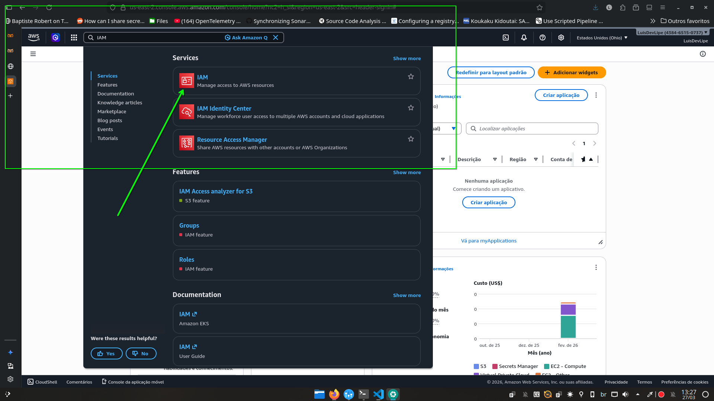

O Amazon Identity and Access Management (IAM) é um serviço da AWS que permite gerenciar o acesso aos recursos da AWS de forma segura. Ele permite criar e gerenciar usuários e grupos, além de definir permissões para acessar os recursos da AWS.


Agora, criaremos um grupo com permissões ao S3 e anexaremos o usuário ao grupo.

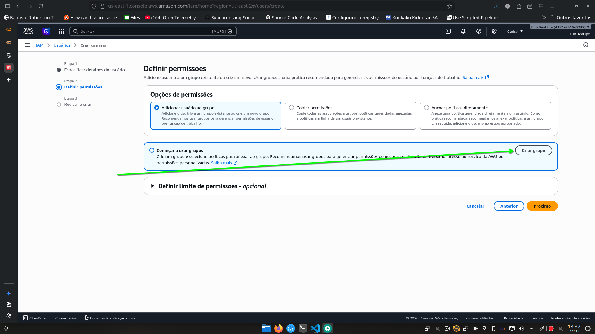


Damos um nome ao grupo e escolhemos a política `AmazonS3FullAccess` para conceder acesso total ao S3.


Selecionamos o grupo criado e clicamos em próximo para revisar as configurações.

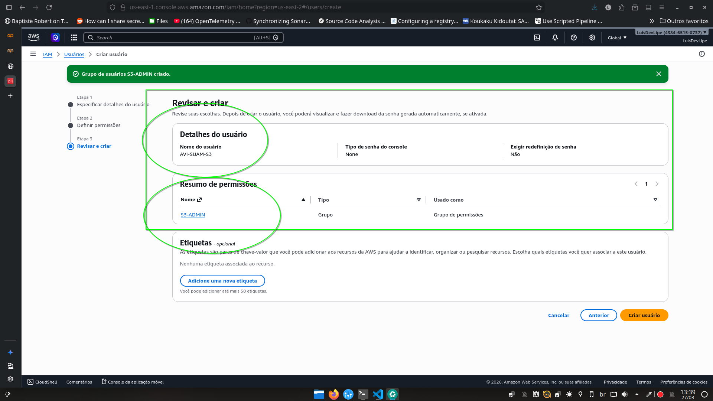

Revisamos as configurações e se estiver tudo correto, clicamos em criar usuário.

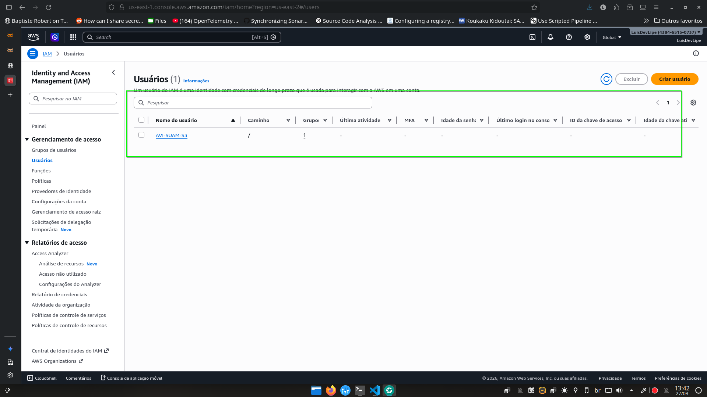


Clicamos no usuário criado e vamos até a aba `credenciais de segurança`, onde clicaremos no botão `habilitar o acesso ao console da AWS`.

Na janela aberta deixaremos selecionada a opção `senha gerada automaticamente` para o usuário e clicamos em `habilitar acesso ao console`.

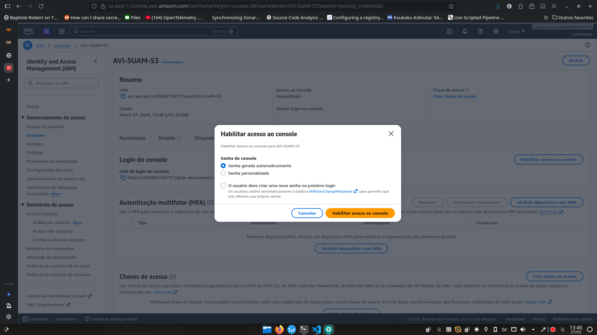

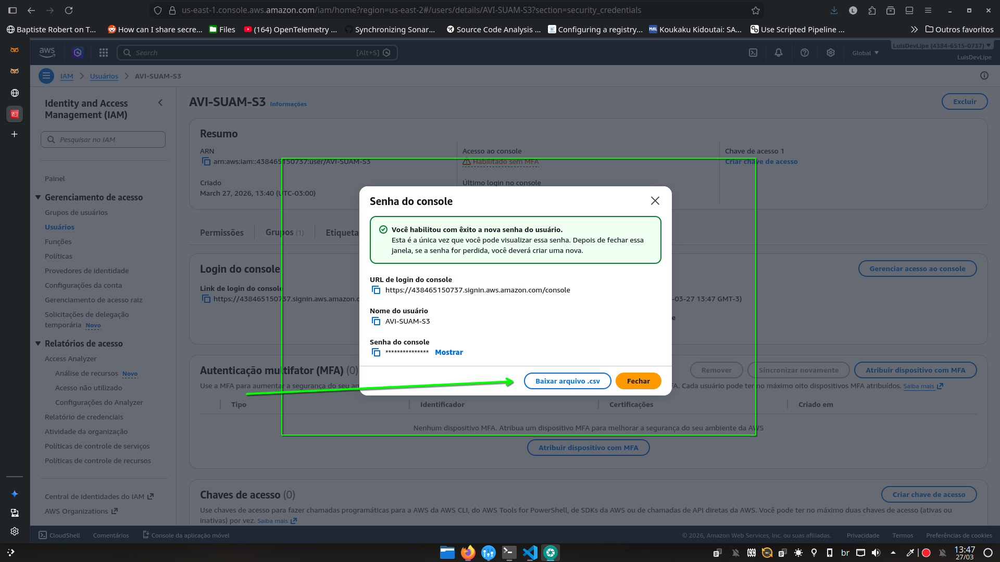

Baixe o arquivo CSV contendo as credencias e o armazene em um local seguro.

Antes de sairmos da conta root, copie o ID do usuário root, pois ele será necessário para entrarmos com o usuário novo criado.

O ID se encontra na lateral direita superior da tela.

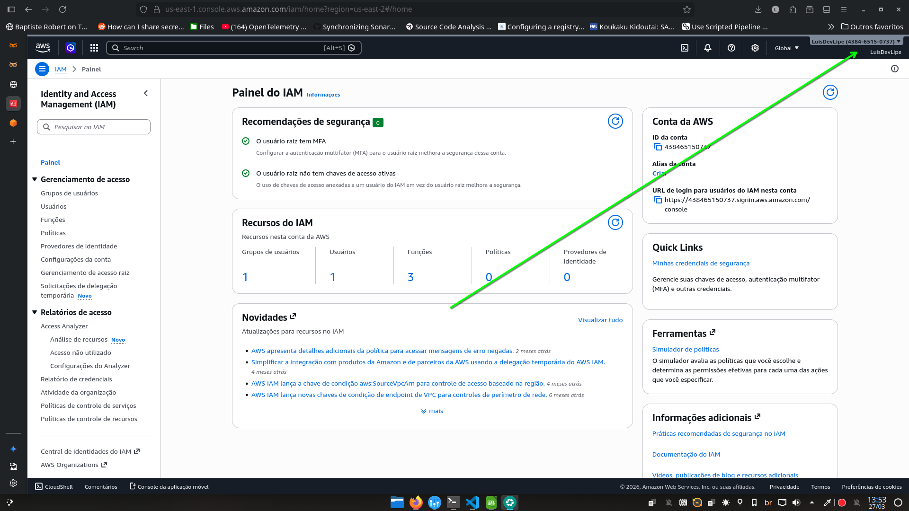

Agora, saímos da conta do root e acessamos o console da AWS utilizando as credenciais do usuário criado. Lembre-se de utilizar o ID do usuário root para acessar a conta.


> Pulamos algumas etapas de configuração do usuário, como configuração de MFA, pois o objetivo é apenas criar um usuário para acessar o S3 e não configurar a segurança da conta. Porém, em casos de uso real é extremamente recomendado configurar a segurança da conta, como MFA, para evitar acessos não autorizados.


Com o usuário criado e com acesso ao console da AWS, agora podemos criar um Bucket no S3 para armazenar os dados migrados do banco de dados on-premises.


Primeiro acesse o serviço do S3 no console da AWS através da barra de pesquisa ou pelo menu de serviços, no topo da tela.


Clique no botão `Criar bucket` para iniciar o processo de criação do bucket.

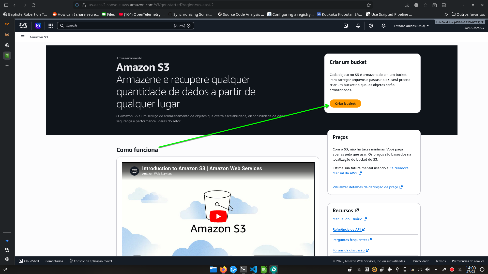

Agora que estamos na tela de criação do Bucket, temos uma série de configurações para realizar.

Focaremos apenas na configuração mais básica, o nome do bucket e a região onde ele será criado.

Importante lembrar que as outras configurações são extramente importantes para garantir a segurança dos dados armazenados, através das `ACLs`e `políticas de bucket`, que controlam o acesso aos dados armazenados.

Assim como o versionamento do bucket, que permite manter versões anteriores dos objetos armazenados, garantindo a durabilidade dos dados.
Além das configurações de criptografia e bloqueio do objeto.

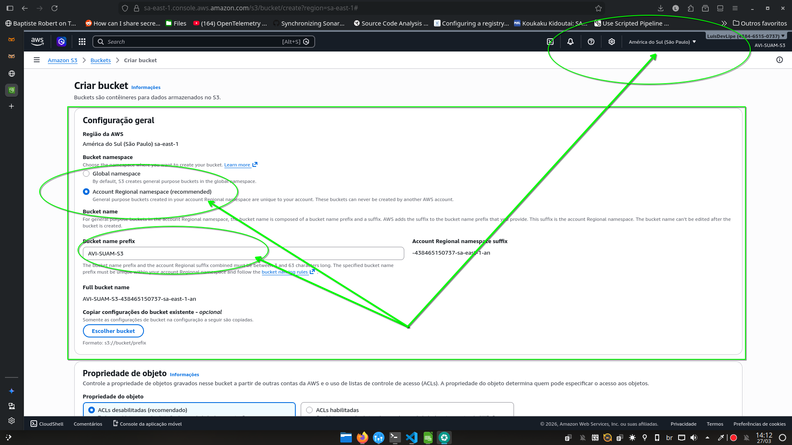

Selecionamos a opção de namespace regional para o bucket, e na lateral superior direita da tela, selecionamos a região onde o bucket será criado. É recomendado escolher uma região próxima ao local onde os dados serão migrados para reduzir a latência e melhorar o desempenho. Selecionamos a região `sa-east-1` (São Paulo) para criar o bucket.

Logo abaixo, definimos o nome do Bucket. E finalmente, clicamos no botão `Criar bucket` localizado no final da página para finalizar o processo de criação do bucket.

> Como exemplo da implementação, imagine que temos um banco de dados on-premises  destinado a aplicações para um cliente da PETROBRAS, e queremos migrar os dados desse banco de dados para a nuvem utilizando o Amazon S3. Para isso, vamos assumir que localmente, os dados do banco de dados já foram exportados para um arquivo CSV, nesse exemplo não utilizaremos a CLI do AWS que seria a forma mais prática de realizar a migração pois nos servidores on-premises não teríamos acesso a interface gráfica do console da AWS, mas para fins de demonstração, iremos imaginar que os dados dos bancos de dados estão armazenados em um sistema de arquivos em rede local, e que através de um computador de admintração com acesso ao armazenamento distribuído local e o console da AWS, podemos realizar a migração dos dados para o S3.

Como exemplo teremos os seguintes dados em um arquivo CSV chamado de TABELA_EQUIPMENT_PETRO.csv:
```csv
equipment_id,equipment_name,location,maintenance_date
1,Compressor A,Plant 1,2024-07-15
2,Generator B,Plant 2,2024-08-20
3,Pump C,Plant 1,2024-09-10
4,Valve D,Plant 3,2024-10-05
5,Conveyor E,Plant 2,2024-11-12
```

Primeiro, selecionamos no bucket criado, a opção `Criar pasta` para criar uma pasta dentro do bucket destinada a PETROBRAS, onde os dados do banco de dados serão armazenados.


Em seguida, damos um nome para a pasta e clicamos em `Criar pasta` para finalizar a criação da pasta. Deixaremos a opção de criptografia na opção padrão.

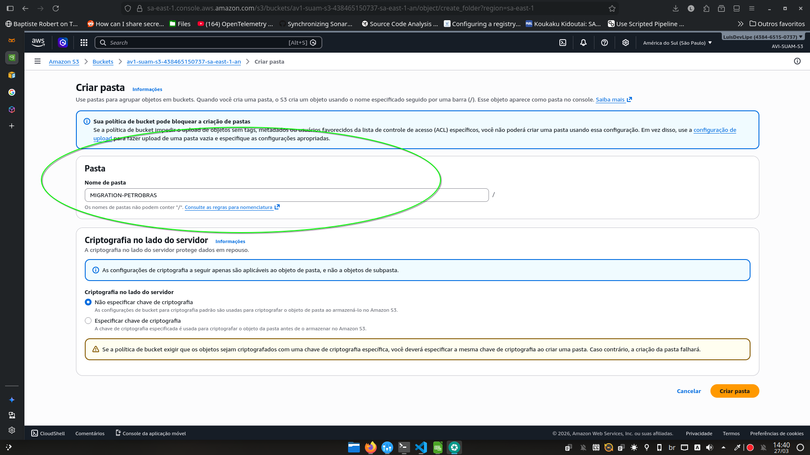

Com a pasta criada, podemos clicar no nome da pasta para acessar o interior dela, e clicar no botão `Carregar` para iniciar o processo de upload dos dados do banco de dados para o S3.


Clicamos em `Adicionar arquivos` para navegarmos no nosso diretório local e escolher o arquivo CSV contendo os dados do banco de dados que queremos migrar para o S3.

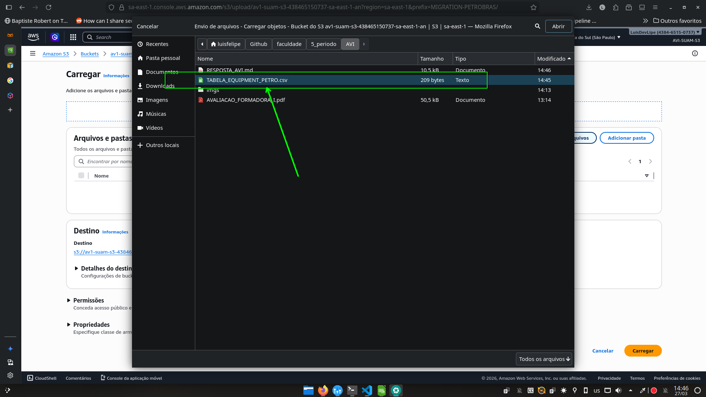

Conferimos agora na listagem de arquivos que o arquivo CSV foi adicionado para o processo de upload, e clicamos em `Carregar` para iniciar o processo de upload do arquivo para o S3.


Se tudo ocorrer bem, veremos uma mensagem de sucesso indicando que todos os arquivos selecionados foram carregados para o S3.


Ao clicarmos no objeto carregado, podemos acessar as suas propriedades, onde possível verificar as permissões de acesso, as versões do objeto (se habilitado), além de outras informações...

O próximo passo seria configurar as permissões de acesso ao objeto, para garantir que apenas usuários autorizados possam acessar os dados armazenados no S3. Para isso, podemos utilizar as `ACLs` e `políticas de bucket` para controlar o acesso aos objetos armazenados.

Além desse passo, precisaremos de uma instância de banco de dados na nuvem, como o Amazon RDS ou outro serviço de banco de dados na nuvem gerenciado ou não para continuar com a migração.

## Escalabilidade

A escalabilidade do Amazon S3 é uma das principais características, o serviço é gerenciado pela AWS e não há limites de capacidade definidos, temos escalabilidade **ilimitada** para armazenar e acessar os dados, óbviamente ao custo de pagar pelo armazenamento e pelas requisições realizadas no serviço, mas não há limites técnicos para a quantidade de dados que podem ser armazenados ou acessados no S3. 

## Disponibilidade

A AWS oferece uma garantia de disponibilidade de 99,99% para o Amazon S3, o que significa que o serviço estará disponível para acesso e uso durante 99,99% do tempo em um período de um ano. Isso é possível graças à arquitetura distribuída do S3, que armazena os dados em múltiplas zonas de disponibilidade (AZs) dentro de uma região da AWS. Cada AZ é projetada para ser isolada e independente, o que significa que se uma AZ falhar, os dados ainda estarão disponíveis em outras AZs, garantindo a alta disponibilidade do serviço. Além disso, a AWS implementa medidas de segurança e redundância para proteger os dados armazenados no S3 contra falhas e perda de dados, como replicação automática dos dados entre AZs e criptografia dos dados em repouso e em trânsito.

## Durabilidade

A durabilidade do Amazon S3 é de 99,999999999% (11 noves) para os objetos armazenados no serviço. Isso significa que a probabilidade de perda de dados é extremamente baixa, mesmo em casos de falhas de hardware ou desastres naturais. Além das medidas de infraestrutura e redundância implementadas pela AWS, o S3 também oferece recursos de versionamento, permitindo que versões distintas dos dados armazenados sejam mantidas, garantindo a durabilidade dos dados mesmo em casos de exclusão acidental ou corrupção de dados.

## Acesso

A AWS oference uma variedade de opções de acesso ao Amazon S3, incluindo acesso via console da AWS, API Restful, SDKs e ferramentas de linha de comando. O acesso ao S3 é controlado por meio de políticas de acesso e permissões, que podem ser configuradas para conceder ou restringir o acesso a buckets e objetos específicos. Além disso, o S3 suporta autenticação multifator (MFA) para aumentar a segurança do acesso aos dados armazenados. 

