# Avaliação Formadora III
Aluno: Luis Felipe Macedo dos Santos

Turma: ADS0501N

Campus: Bonsucesso

Primeiro passo ao acessar o console da AWS é criar uma conta no IAM com permissões de acesso ao S3. Utilizaremos esse usuário para criar e gerenciar o Bucket no S3.


O Amazon Identity and Access Management (IAM) é um serviço da AWS que permite gerenciar o acesso aos recursos da AWS de forma segura. Ele permite criar e gerenciar usuários e grupos, além de definir permissões para acessar os recursos da AWS.

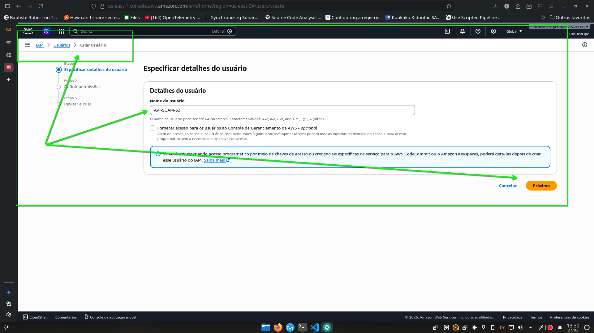

Agora, criaremos um grupo com permissões ao S3 e anexaremos o usuário ao grupo.


Damos um nome ao grupo e escolhemos a política `AmazonS3FullAccess` para conceder acesso total ao S3.

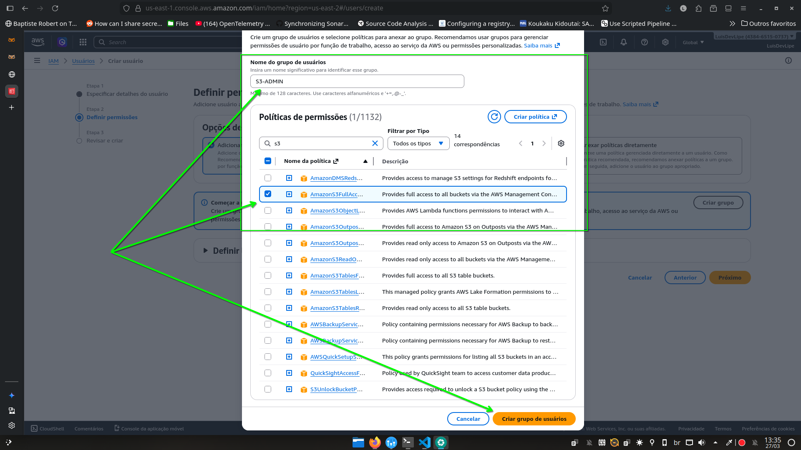


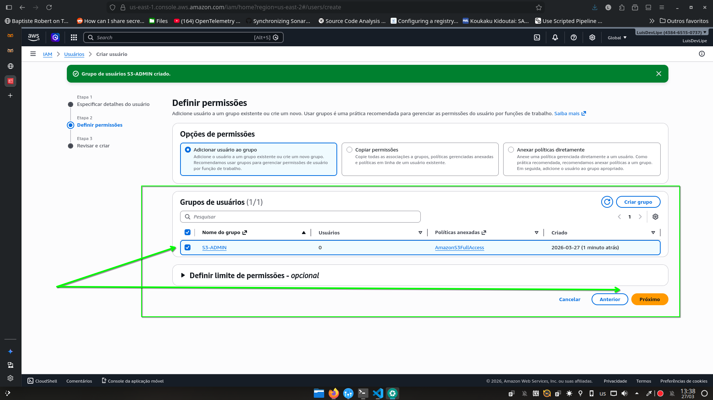

Selecionamos o grupo criado e clicamos em próximo para revisar as configurações.


Revisamos as configurações e se estiver tudo correto, clicamos em criar usuário.


Clicamos no usuário criado e vamos até a aba `credenciais de segurança`, onde clicaremos no botão `habilitar o acesso ao console da AWS`.

Na janela aberta deixaremos selecionada a opção `senha gerada automaticamente` para o usuário e clicamos em `habilitar acesso ao console`.


Baixe o arquivo CSV contendo as credencias e o armazene em um local seguro.

Antes de sairmos da conta root, copie o ID do usuário root, pois ele será necessário para entrarmos com o usuário novo criado.

O ID se encontra na lateral direita superior da tela.


Agora, saímos da conta do root e acessamos o console da AWS utilizando as credenciais do usuário criado. Lembre-se de utilizar o ID do usuário root para acessar a conta.


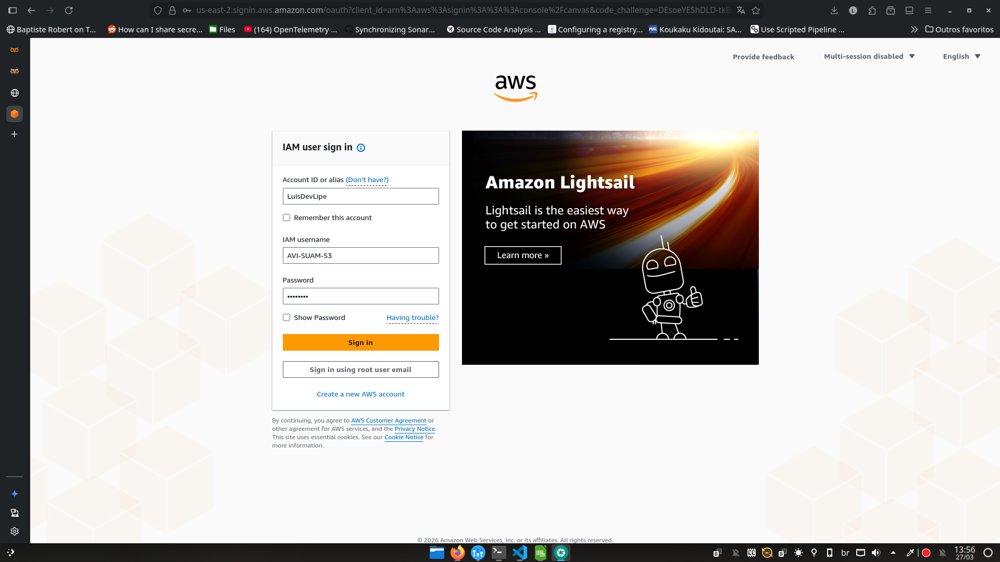


> Pulamos algumas etapas de configuração do usuário, como configuração de MFA, pois o objetivo é apenas criar um usuário para acessar o S3 e não configurar a segurança da conta. Porém, em casos de uso real é extremamente recomendado configurar a segurança da conta, como MFA, para evitar acessos não autorizados.


Com o usuário criado e com acesso ao console da AWS, agora podemos criar um Bucket no S3 para armazenar os dados migrados do banco de dados on-premises.


Primeiro acesse o serviço do S3 no console da AWS através da barra de pesquisa ou pelo menu de serviços, no topo da tela.

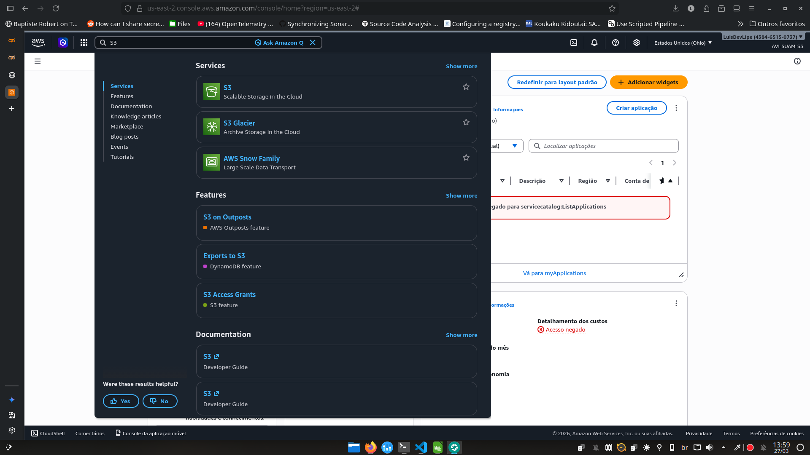

Clique no botão `Criar bucket` para iniciar o processo de criação do bucket.


Agora que estamos na tela de criação do Bucket, temos uma série de configurações para realizar.

Focaremos apenas na configuração mais básica, o nome do bucket e a região onde ele será criado.

Importante lembrar que as outras configurações são extramente importantes para garantir a segurança dos dados armazenados, através das `ACLs`e `políticas de bucket`, que controlam o acesso aos dados armazenados.

Assim como o versionamento do bucket, que permite manter versões anteriores dos objetos armazenados, garantindo a durabilidade dos dados.
Além das configurações de criptografia e bloqueio do objeto.


Selecionamos a opção de namespace regional para o bucket, e na lateral superior direita da tela, selecionamos a região onde o bucket será criado. É recomendado escolher uma região próxima ao local onde os dados serão migrados para reduzir a latência e melhorar o desempenho. Selecionamos a região `sa-east-1` (São Paulo) para criar o bucket.

Logo abaixo, definimos o nome do Bucket. E finalmente, clicamos no botão `Criar bucket` localizado no final da página para finalizar o processo de criação do bucket.

> Como exemplo da implementação, imagine que temos um banco de dados on-premises  destinado a aplicações para um cliente da PETROBRAS, e queremos migrar os dados desse banco de dados para a nuvem utilizando o Amazon S3. Para isso, vamos assumir que localmente, os dados do banco de dados já foram exportados para um arquivo CSV, nesse exemplo não utilizaremos a CLI do AWS que seria a forma mais prática de realizar a migração pois nos servidores on-premises não teríamos acesso a interface gráfica do console da AWS, mas para fins de demonstração, iremos imaginar que os dados dos bancos de dados estão armazenados em um sistema de arquivos em rede local, e que através de um computador de admintração com acesso ao armazenamento distribuído local e o console da AWS, podemos realizar a migração dos dados para o S3.

Como exemplo teremos os seguintes dados em um arquivo CSV chamado de TABELA_EQUIPMENT_PETRO.csv:
```csv
equipment_id,equipment_name,location,maintenance_date
1,Compressor A,Plant 1,2024-07-15
2,Generator B,Plant 2,2024-08-20
3,Pump C,Plant 1,2024-09-10
4,Valve D,Plant 3,2024-10-05
5,Conveyor E,Plant 2,2024-11-12
```

Primeiro, selecionamos no bucket criado, a opção `Criar pasta` para criar uma pasta dentro do bucket destinada a PETROBRAS, onde os dados do banco de dados serão armazenados.

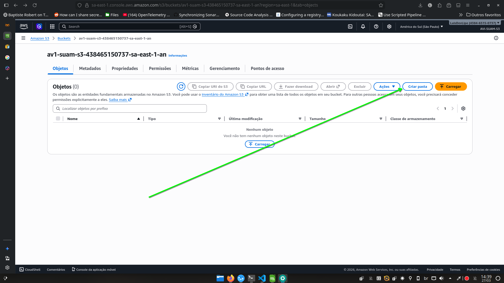

Em seguida, damos um nome para a pasta e clicamos em `Criar pasta` para finalizar a criação da pasta. Deixaremos a opção de criptografia na opção padrão.


Com a pasta criada, podemos clicar no nome da pasta para acessar o interior dela, e clicar no botão `Carregar` para iniciar o processo de upload dos dados do banco de dados para o S3.

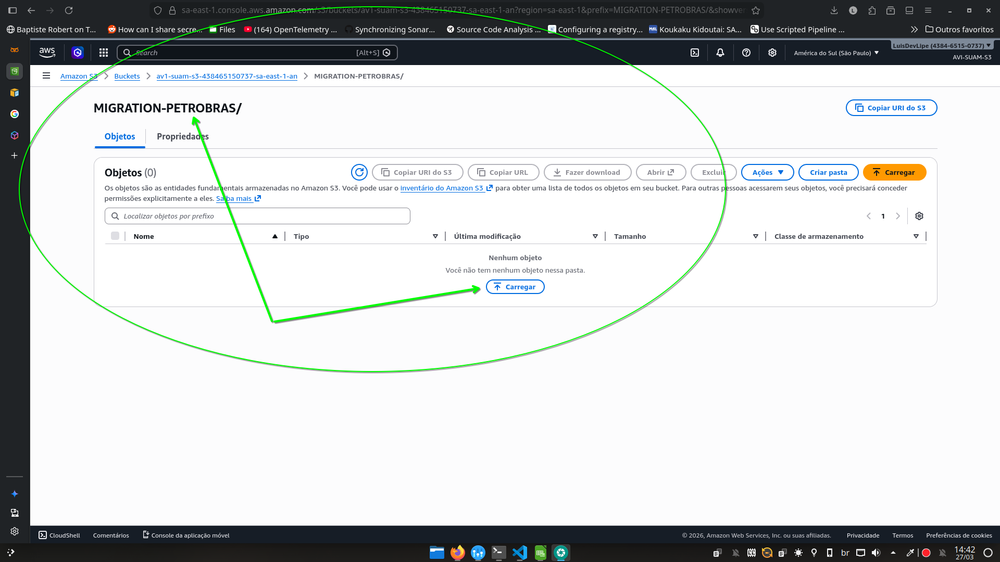

Clicamos em `Adicionar arquivos` para navegarmos no nosso diretório local e escolher o arquivo CSV contendo os dados do banco de dados que queremos migrar para o S3.


Conferimos agora na listagem de arquivos que o arquivo CSV foi adicionado para o processo de upload, e clicamos em `Carregar` para iniciar o processo de upload do arquivo para o S3.

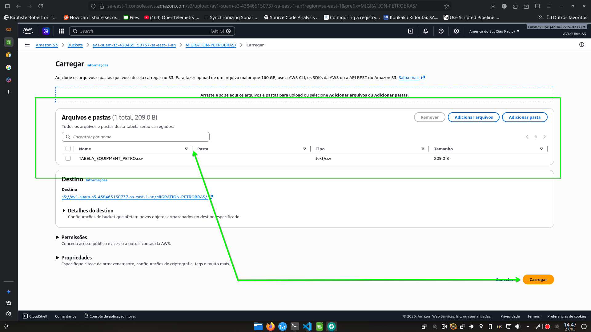

Se tudo ocorrer bem, veremos uma mensagem de sucesso indicando que todos os arquivos selecionados foram carregados para o S3.

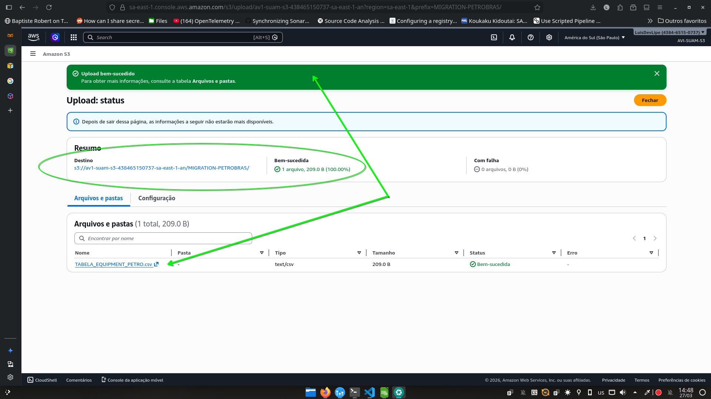

Ao clicarmos no objeto carregado, podemos acessar as suas propriedades, onde possível verificar as permissões de acesso, as versões do objeto (se habilitado), além de outras informações...

Para tornarmos o Bucket público, clicamos na aba `Permissões` e selecionamos editar na seção `Bloquear acesso público (configurações do bucket)`

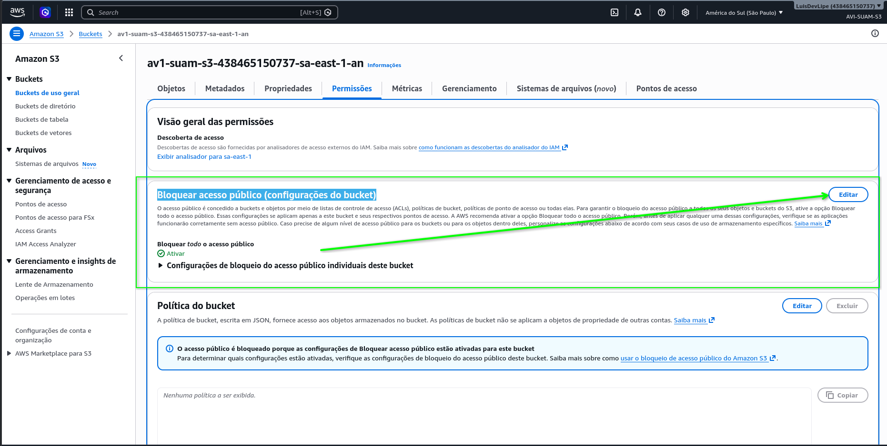

Desmarcamos a opção `Bloquear todo o acesso público` e clicamos em `Salvar alterações` para tornar o bucket público.

image22.png)

Na tela de confirmações digite `confirmar` para confirmar a alteração e clique em `Confirmar` para finalizar o processo de tornar o bucket público.

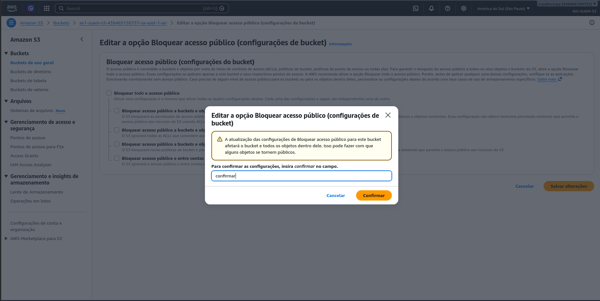

Na tela de propriedades do objeto, clicamos na URL do objeto para acessar o arquivo CSV contendo os dados do banco de dados migrados para o S3.

Se o arquivo ainda não estiver disponível, pode ser necessário ajustar as permissões de acesso com ACLs ou políticas de bucket para garantir que o arquivo seja acessível publicamente.

Na tela de permissões, se a seguinte mensagem aparecer.

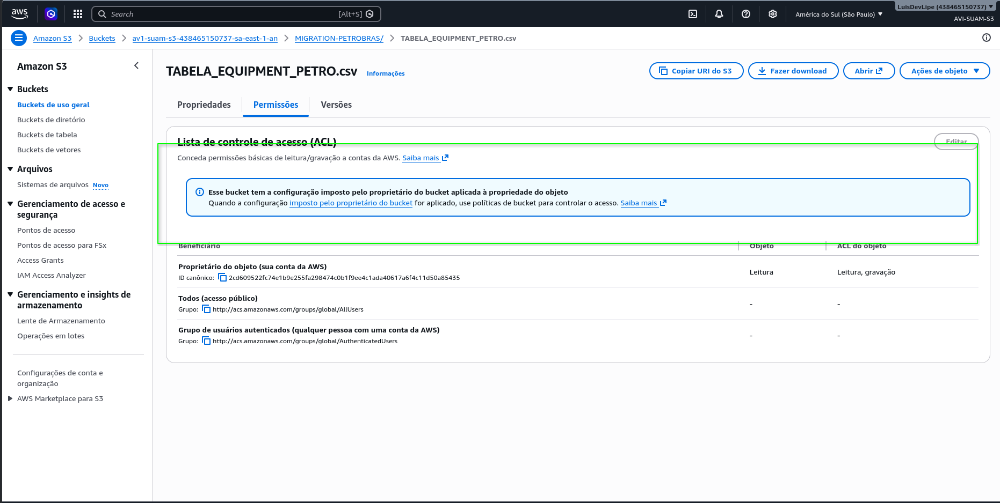

Clique no link `imposto pelo proprietário do bucket` para acessar as configurações de ACLs do bucket.

Selecione a opção ACLs habilitadas, marque a opção `Reconheço que as ACLs serão restauradas` e clique em `Salvar alterações` para habilitar as ACLs no bucket.

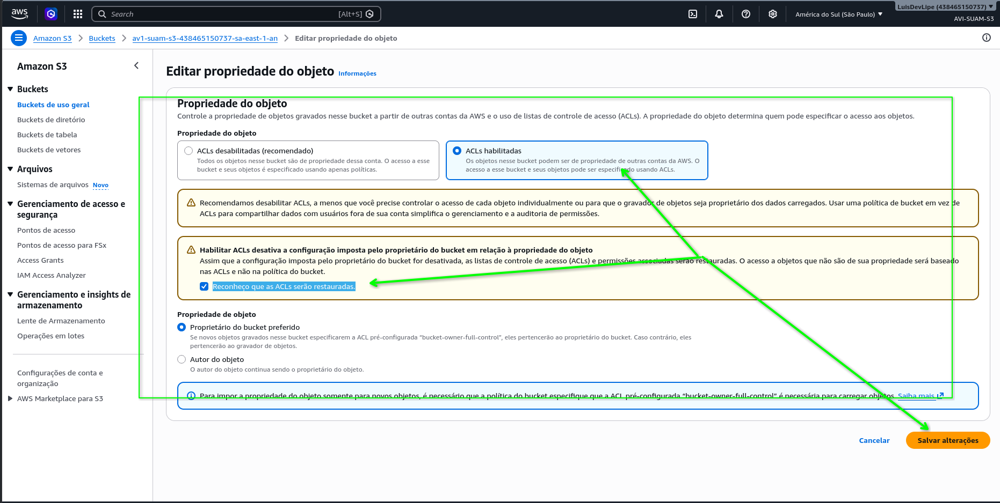

Volte novamente no objeto, na aba `Permissões` e clique em `Editar` na seção `Lista de controle de acesso (ACL)` para editar as ACLs do objeto.

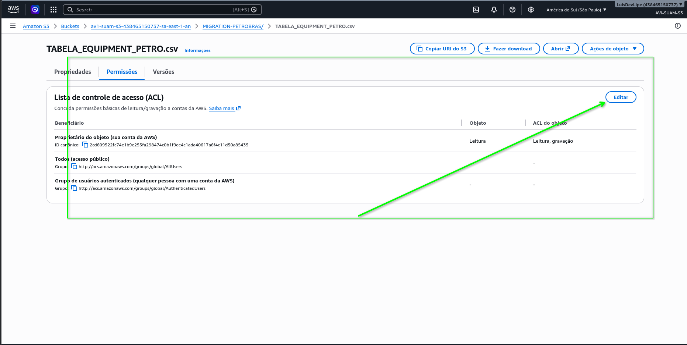

Marque as opções `Leitura de objeto` e a caixa `Compreendo os efeitos dessas alterações nesse objeto` e clique em `Salvar alterações` para conceder permissão de leitura ao objeto para o público.

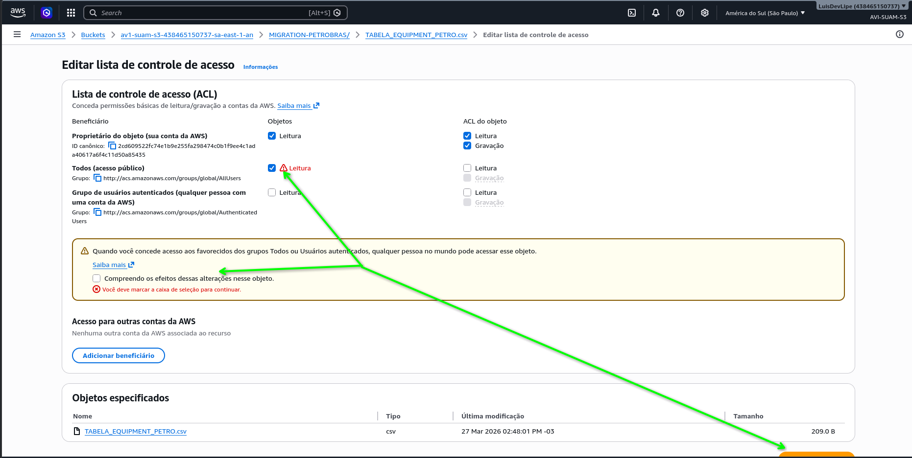

Na tela de propriedas do objeto, clique na URL do objeto para acessar o arquivo CSV.

Ele será baixado automaticamente no seu navegador.


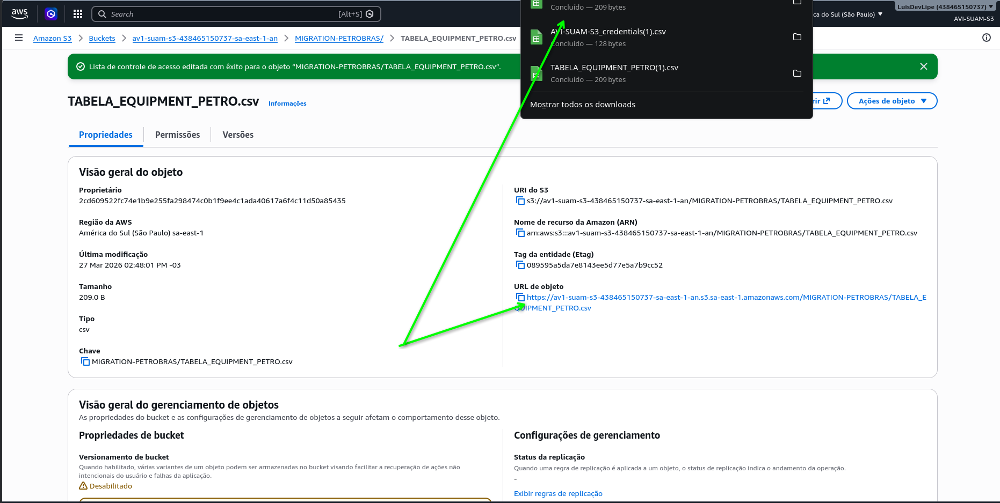