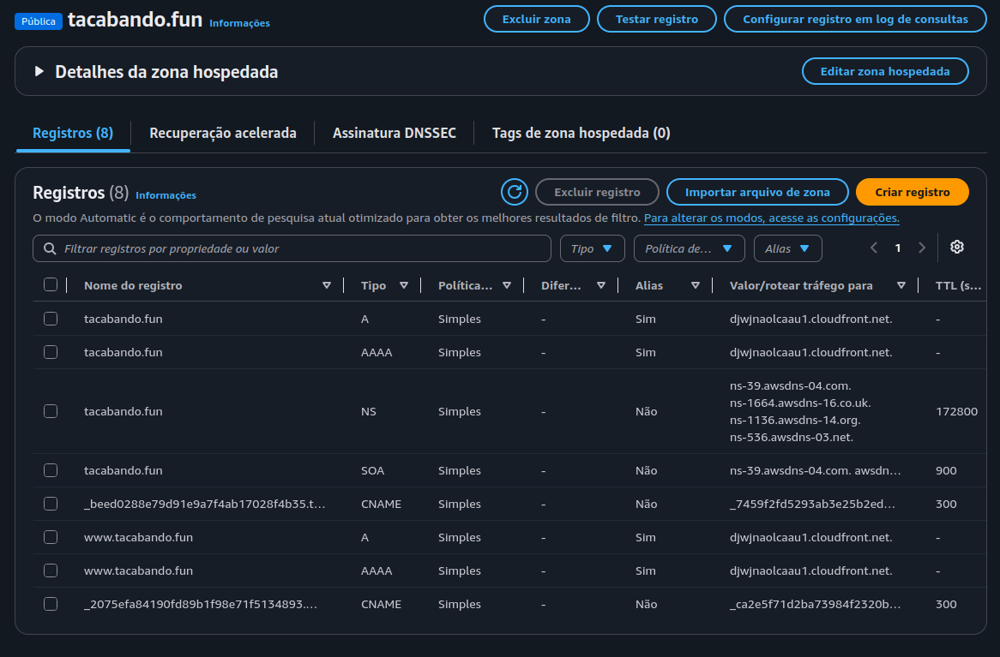
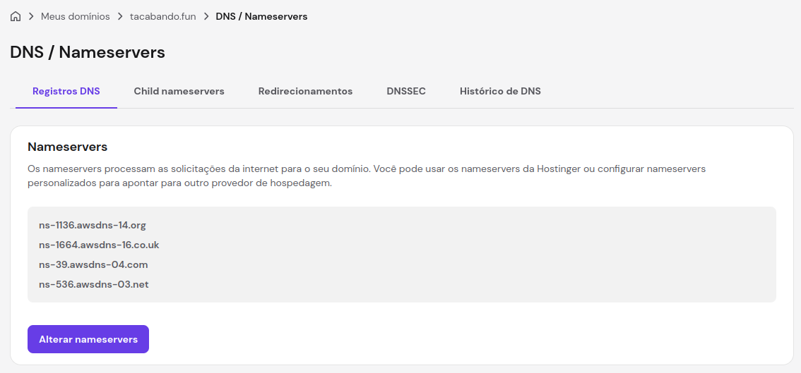
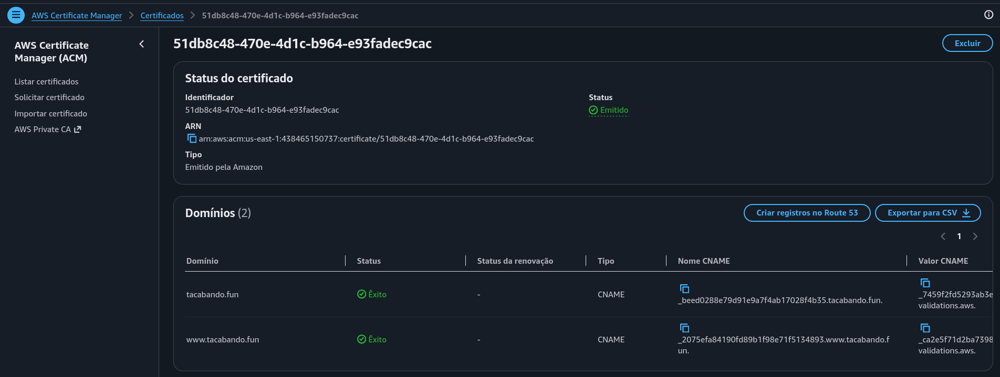
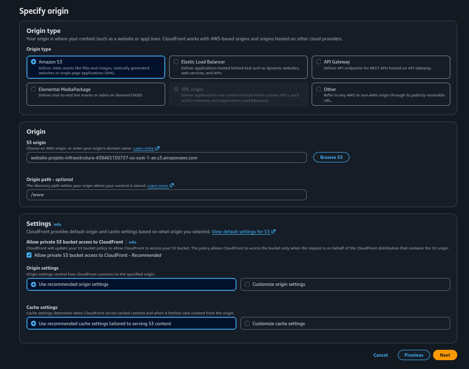
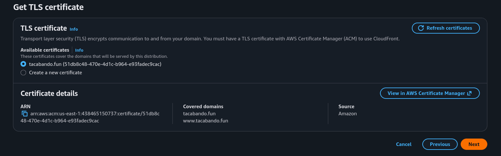
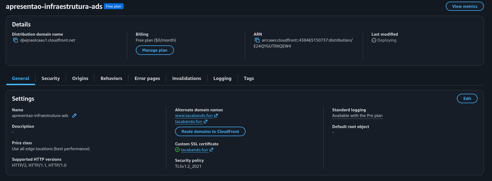
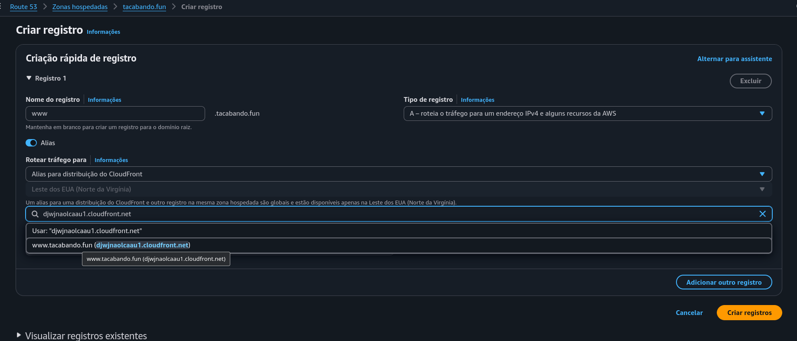

# Site estático na AWS com infraestrutura serverless

Autor: Luis Felipe Macedo dos Santos
Turma: 5º Período - ADS0301N - Bonsucesso
Curso: Análise e Desenvolvimento de Sistemas

---

# Introdução

* Com os serviços de Nuvem, é possível criar e servir aplicações em escala global, com alta disponibilidade e desempenho otimizado.

* Sem se preocupar com a infraestrutura subjacente, sem custos de manutenção de hardware e sem perder tempo providenciando e configurando todo o ambiente físico.

---

# Nesse projeto
Iremos hospedar um site estático na AWS que atende a escalas globais, faz utilização de criptografia para proteger a comunicação com o usuário e utiliza caching para diminuir a latência entre as requisições.

---

## Serviços utilizados

* AWS
    * Route 53
    * Certificate Manager
    * CloudFront
    * S3 (Simple Storage Service)
---

* Hostinger
    - compra do domínio tacabando.fun

---

# Desenho da arquitetura do projeto

---

# <!--fit--> Responsabilidades de cada serviço

--- 

# AWS Route 53
* Custo da zona hospedada tacabando.fun $0,50 USD por mês
* O tráfego que chega em **tacabando.fun** e **www.tacabando.fun** é redirecionado para a **distribuição** do **Amazon CloudFront**.

---

## S3
* Versionamento do Bucket Ativado
* Bloqueio de acesso público ativado
* Política de acesso para permitir que o CloudFront acesse os arquivos do Bucket

---

## Certificate Manager
* Certificado SSL/TLS gratuito gerado para o domínio www.tacabando.fun e tacabando.fun.
* Garantia de que o acesso ao site seja criptografado e seguro. 

---

## CloudFront - Distribuição no Plano Gratuito

* Atende a 1M de solicitações ou 100GB (transferência de dados) por mẽs
* Entrega o conteúdo em cache ou busca no S3.

> O certificado SSL/TLS gerado no Certificate Manager é integrado ao CloudFront.

---

# Domínio

Domínio registrado na hostinger por R$7,09 Reais por ano (1º ano com desconto)

---

# Arquitetura do projeto: Hands on

---

### Hostinger

* O Domínio foi registrado na Hostinger 

---
### Route 53

Criamos uma Zona Hospedada, e depois, trocamos os nameservers no registrar com os namerservers da AWS.

---
### Hostinger

Configurado para utilizar os nameservers da AWS.

---

### Certificate Manager

Geramos um certificado SSL/TLS na AWS.

> Usaremos um certificado com validação por **DNS**.

---

* O Amazon Certificate Manager gera um certificado SSL/TLS para o domínio
    - permitindo que o acesso ao site seja criptografado e seguro
    - O certificado é integrado ao CloudFront
---
### Route 53

> A validação do certificado SSL/TLS é feita por registros ***CNAME*** no **Route 53**

Criamos registros **CNAME** dentro da Zona Hospedada para que o **ACM** verifique a propriedade do domínio

---

### S3 - *Simple Storage Service*

O S3 será o nosso servidor de certo modo.

Os arquivos estáticos do site estarão hospedados no S3.

O CloudFront servirá os arquivos que colocarmos no Bucket.

> Nota: Não precisamos ativar a opção de hospedagem estática no Bucket do S3.

> Nota: Não precisar permitir o acesso público ao Bucket. O CloudFront fará a leitura dos arquivos através de políticas de segurança

---

### CloudFront

Agora que temos:

* Certificado SSL/TLS válido
* Arquivos dos site estático em um Bucket no S3.

Podemos criar uma distribuição no CloudFront.

---

#### Distribuição CloudFront

---

##### Distribuição CloudFront - Seleção do certificado SSL/TLS

---

#### Resultado da configuração da distribuição

---

Com a distruição do CloudFront configurada para servir os arquivos do Bucket no S3,

utilizando os certificado gerados no AWS Certificate Manager

---

#### Registro DNS (Alias para a distribuição)
Agora precisamos configurar registro do tipo A (IPV4) e AAAA (IPV6) do tipo **alias**,

Para encaminhar o tráfego até a distribuição do CloudFront,

que por sua vez, servirá os arquivos do Bucket no S3 com certificados SSL/TLS.

---

# Resultado

---
