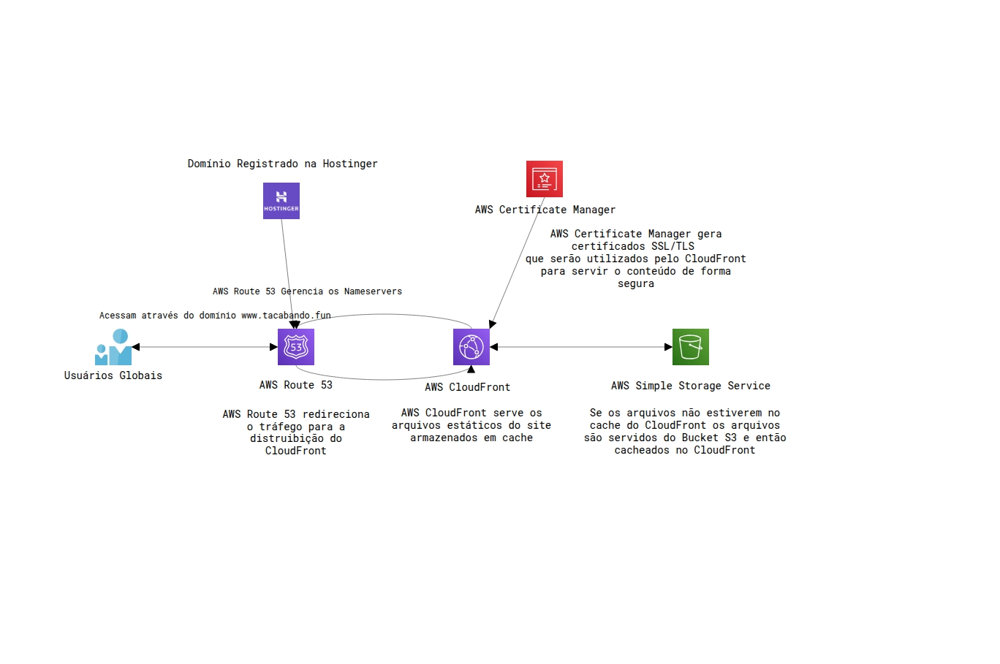
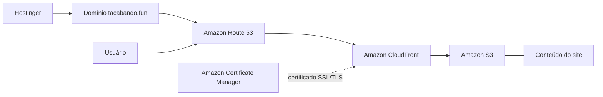

# Site estático na AWS com infraestrutura serverless

Autor: Luis Felipe Macedo dos Santos
Turma: 5º ADS0301N - Bonucesso
Curso: Análise e Desenvolvimento de Sistemas

---

# Introdução

* Com os serviços de Nuvem, é possível criar e servir aplicações em escala global, com alta disponibilidade e desempenho otimizado.

* Sem se preocupar com a infraestrutura subjacente, sem custos de manutenção e sem perder tempo providenciando e configurando todo o ambiente físico.

---

# Nesse projeto
Iremos hospedar um site estático na AWS, que atende a escalas globais, faz utilização de criptografia para proteger a comunicação com o usuário e utiliza caching para diminuir a latência entre as requisições.

---

## Serviços utilizados

* AWS
    * Route 53
    * Certificate Manager
    * CloudFront
    * S3 (Simple Storage Service)
---

* Hostinger
    - compra do domínio tacabando.fun

---

# Desenho da arquitetura do projeto

# AWS Route 53
* Custo da zona hospedada tacabando.fun $0,50 USD por mês
* O tráfego que chega em **tacabando.fun** e **www.tacabando.fun** é redirecionado para a **distribuição** do **Amazon CloudFront**.

---

# S3
* Versionamento Ativado
* Bloqueio de acesso público ativado
* Política de acesso para permitir que o CloudFront acesse os arquivos do Bucket

---

# Certificate Manager
* Certificado SSL/TLS gratuito gerado para o domínio www.tacabando.fun e tacabando.fun.
* Garantia de que o acesso ao site seja criptografado e seguro. 

---

# CloudFront

## Plano Gratuito

* Atende a 1M de solicitações ou 100GB (transferência de dados) por mẽs
* Entrega o conteúdo em cache ou busca no S3.

> O certificado SSL/TLS gerado no Certificate Manager é integrado ao CloudFront.

---

# Domínio

Domínio registrado na hostinger por R$7,09 Reais por ano (1º ano com desconto)

---

# Arquitetura do projeto

* O Domínio foi registrado na Hostinger 
    - configurado para utilizar os nameservers da AWS.

* O Amazon Route 53 gerencia o tráfego de usuários no domínio tacabando.fun e www.tacabando.fun
    - direcionando-os para a distribuição do Amazon CloudFront. 

---

* O CloudFront, por sua vez, entrega o conteúdo do site hospedado no Amazon S3
* O CloudFront faz caching do conteúdo do site
    - reduzindo a latência 
    - diminuindo os custos de transferência de dados do Bucket no S3. 
* garantindo alta disponibilidade 
* desempenho otimizado para os usuários finais.

---

* O Amazon Certificate Manager gera um certificado SSL/TLS para o domínio
    - permitindo que o acesso ao site seja criptografado e seguro
    - O certificado é integrado ao CloudFront

--- 

# <!--fit-->Diagramas

---

## Com o diagrama abaixo é possível visualizar a arquitetura do projeto:

---

