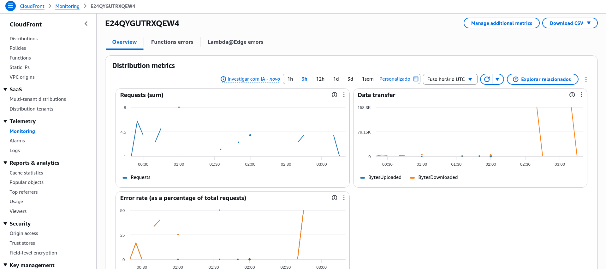
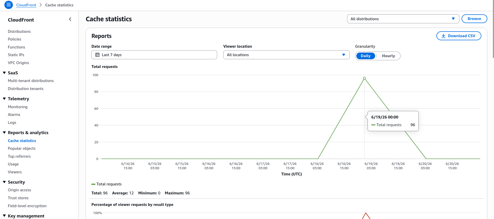

---
# Site estático na AWS com arquitetura serverless

Autor: Luis Felipe Macedo dos Santos
Turma: 5º Período - ADS0301N - Bonsucesso
Curso: Análise e Desenvolvimento de Sistemas

---

# Introdução

* Com os serviços de Nuvem da AWS, é possível criar e servir aplicações em escala global, com alta disponibilidade e desempenho otimizado.

* Sem se preocupar com a infraestrutura subjacente, sem custos de manutenção de hardware e sem perder tempo providenciando e configurando todo o ambiente físico.

---

# Nesse projeto
Iremos hospedar um site estático na AWS que atende a escalas globais, faz utilização de criptografia para proteger a comunicação entre o servidor e o usuário e utiliza caching para diminuir a latência entre as requisições.

---

## Serviços utilizados

* AWS
    * Route 53
    * Certificate Manager
    * CloudFront
    * S3 (Simple Storage Service)
* Hostinger
    - compra do domínio tacabando.fun

---

# Desenho da arquitetura do projeto

---

# <!--fit--> Responsabilidades de cada serviço

--- 

# AWS Route 53
* Custo da zona hospedada tacabando.fun $0,50 USD por mês
* O tráfego que chega em **tacabando.fun** e **www.tacabando.fun** é redirecionado para a **distribuição** do **Amazon CloudFront**.

---

## S3
* Versionamento do Bucket Ativado
* Bloqueio de acesso público ativado
* Política de acesso para permitir que o CloudFront acesse os arquivos do Bucket

Os arquivos do site ficarão guardados aqui.

---

## Certificate Manager
* Certificado SSL/TLS gratuito gerado para o domínio www.tacabando.fun e tacabando.fun.
* Garantia de que o acesso ao site seja criptografado e seguro. 

---

## CloudFront - Distribuição no Plano Gratuito

* Atende a 1M de solicitações ou 100GB (transferência de dados) por mẽs
* Entrega o conteúdo em cache ou busca no S3.

> O certificado SSL/TLS gerado no Certificate Manager é integrado ao CloudFront.

Efetivamente, esse é o nosso servidor

---

# Domínio (registrar)

Domínio registrado na hostinger por R$7,09 Reais por ano (1º ano com desconto)

---

# Desenvolvendo o projeto
## Hands on
---

### Hostinger

* O Domínio foi registrado na Hostinger
> Configuramos os nameservers da Hostinger com os nameservers do Route 53 mais pra frente.

> Os nameserver são informados no console da AWS após criarmos a zona hospedada no Route 53.

---

Qualquer domínio pode ser usado, desde que seja possível configurar os nameservers. Não importa o registrar.

---
### Route 53

* Criamos uma Zona Hospedada.
* Copiamos registros ns
* Colamos na configuração do registrar.
--- 

---

***Adiantando a tarefa:*** Nameservers já configurados

---

### Certificate Manager

Geramos um certificado SSL/TLS na AWS.

> Usaremos um certificado com validação por **DNS**.

---

* O Amazon Certificate Manager gera um certificado SSL/TLS para o domínio que escolhemos
* permitindo que o acesso ao site seja criptografado e seguro
* O certificado fica integrado ao CloudFront
* É renovado automaticamente
---
### Route 53

> A validação do certificado SSL/TLS é feita por registros ***CNAME*** no **Route 53**

Criamos os registros **CNAME** informados pelo **ACM** dentro da Zona Hospedada para que o **ACM** verifique que o domínio é de nossa propriedade e emita o certificado.

---

### S3 - *Simple Storage Service*

* Os arquivos estáticos do site estarão hospedados no S3.

* O CloudFront servirá os arquivos que colocarmos no Bucket.

---

> Nota: Não precisamos ativar a opção de hospedagem estática no Bucket do S3.

---

> Nota: Não precisamos permitir o acesso público ao Bucket. O CloudFront fará a leitura dos arquivos através de políticas de segurança

---

### CloudFront

Agora que temos:

* Certificado SSL/TLS válido
* Arquivos dos site estático em um Bucket no S3.

---
# <!--fit--> Podemos criar uma **distribuição** no **CloudFront**.

---
## **Passos**

* Informamos que a origem dos arquivos é o Bucket no S3
* Informamos o nome do Bucket
* Informamos o caminho raiz dos arquivos

---

#### Distribuição CloudFront

---

#### Seleção do certificado SSL/TLS

Na próxima tela selecionamos o certificado gerado no AWS Certificate Manager

---

---

# <!--fit--> E por fim, teremos uma **distribuição** do **CloudFront**.
---
#### Resultado da configuração da distribuição

---

# O que temos até agora?

* Arquivos hospedados no S3
* Certificado SSL/TLS gerado no Certificate Manager
* Distribuição do CloudFront configurada para servir os arquivos do S3 utilizando o certificado SSL

---

# O que falta?

* Configurar o Route 53 para encaminhar o tráfego do domínio para a distribuição do CloudFront.

---

#### Registro DNS (Alias para a distribuição)
* Agora precisamos configurar registros do tipo A (IPV4) e do tipo AAAA (IPV6) como **alias**

--- 

---

# Resultado

O Route 53 resolve o nome do domínio para a distribuição do CloudFront.

---

A distribuição do CloudFront protege a conexão com o certificado SSL/TLS

---

Busca o arquivos no Bucket do S3 e entrega para o usuário.

---

Se o arquivo foi acessado recentemente, o CloudFront entrega o arquivo em cache, diminuindo a latência e melhorando a experiência do usuário.

---

# Se você quer ver com seus próprios olhos, acesse o site: 
# <!--fit--> [www.tacabando.fun](https://www.tacabando.fun)

--- 

# No Painel do CloudFront, tambem podemos ver:

Métricas de telemetria e relatórios de acesso estatísticas de cache e rotas mais acessadas.

---

---

---