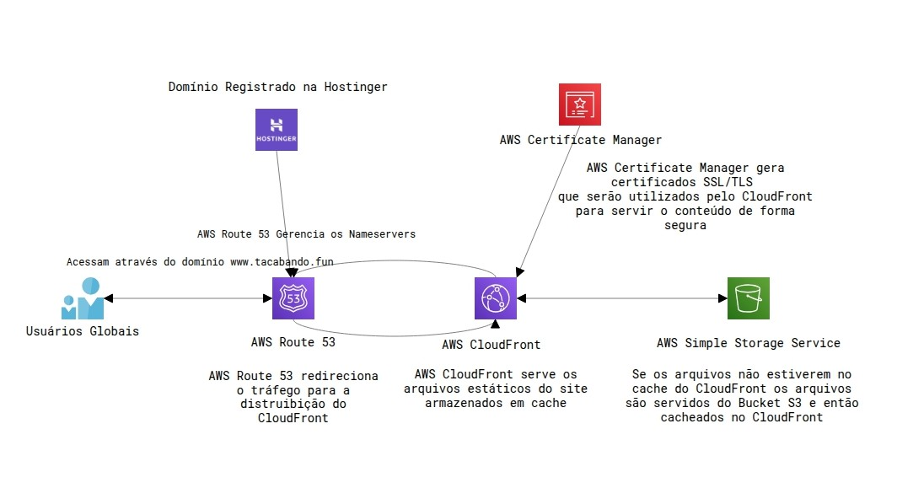

# Site estático na AWS com arquitetura serverless

Autor: Luis Felipe Macedo dos Santos
Turma: 5º Período - ADS0301N - Bonsucesso
Curso: Análise e Desenvolvimento de Sistemas

---

# Introdução

* Com os serviços de Nuvem da AWS, é possível criar e servir aplicações em escala global, com alta disponibilidade e desempenho otimizado.

* Sem se preocupar com a infraestrutura subjacente, sem custos de manutenção de hardware e sem perder tempo providenciando e configurando todo o ambiente físico.

---

# Nesse projeto
Iremos hospedar um site estático na AWS que atende a escalas globais, faz utilização de criptografia para proteger a comunicação entre o servidor e o usuário e utiliza caching para diminuir a latência entre as requisições.

---

## Serviços utilizados

* AWS
    * Route 53
    * Certificate Manager
    * CloudFront
    * S3 (Simple Storage Service)
* Hostinger
    * compra do domínio tacabando.fun

---

# <!--fit--> Desenho da arquitetura do projeto

---

---
# Objetivo do projeto

Hospedar um site estático com:
* Conexão segura entre o usuário e o servidor
* Entrega rápido do conteúdo ao cliente ao acessar o site
* Possibilidade de personalizar o domínio do site
* Escalável e com alta disponibilidade
* Baixo custo de manutenção

---

# Configuração

* Domínio registrado na Hostinger
* Zona hospedada criada no Route 53
* Certificado emitido no ACM com validação por DNS
* Arquivos do site ficam hospedados no S3
* CloudFront configurado como distribuição

---

# Resultado
* acesso seguro com HTTPS
* entrega rápida com cache
* domínio personalizado

* O Route 53 aponta o domínio para o CloudFront
* O CloudFront entrega os arquivos do S3 com HTTPS
* O cache do CloudFront reduz a latência de acesso

## [Acesse o site em: www.tacabando.fun](https://www.tacabando.fun)
---